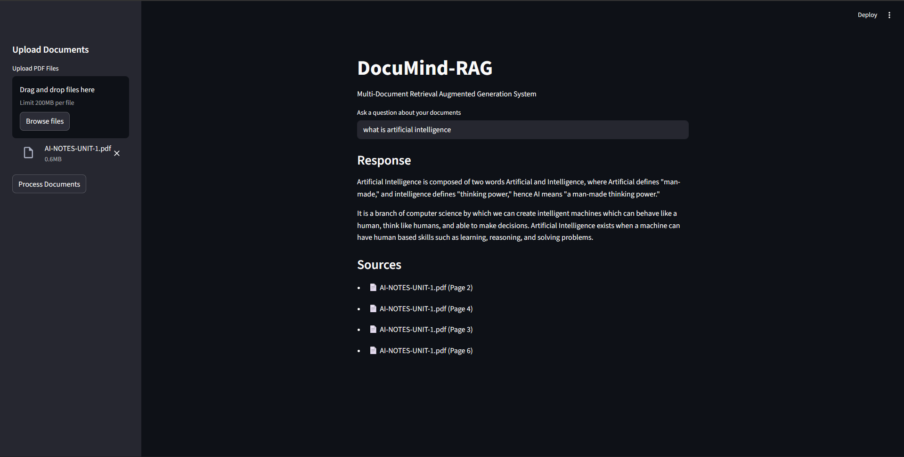

# DocuMind-RAG

### Multi-Document Retrieval Augmented Generation (RAG) System using LangChain (LCEL), Google Gemini and FAISS


---

## Application Preview



---

## Overview

DocuMind-RAG is a Streamlit-based AI application that enables conversational interaction with multiple PDF documents using Retrieval Augmented Generation (RAG).

The system extracts content from uploaded documents, generates embeddings, stores them in a FAISS vector database, and retrieves semantically relevant chunks to generate grounded responses using Google Gemini.

This project demonstrates practical implementation of:

- Vector Databases
- Embeddings & Semantic Search
- Retrieval Augmented Generation (RAG)
- LangChain Expression Language (LCEL)
- LLM Orchestration
- Conversational AI Systems

---

## Why This Project Matters

Large Language Models (LLMs) do not have access to private or real-time data by default.

This project demonstrates how Retrieval Augmented Generation (RAG) enables:

- Grounded responses from private documents
- Reduced hallucination
- Context-aware reasoning
- Scalable semantic search
- Production-ready GenAI pipelines

It reflects practical system design beyond simple chatbot implementations.

---

## Architecture

The system follows a standard RAG pipeline:

1. Document Ingestion
2. Text Chunking
3. Embedding Generation
4. Vector Storage (FAISS)
5. Semantic Retrieval
6. LLM Response Generation

### Flow

User Query → Query Embedding → Similarity Search → Context Retrieval → Gemini → Final Response

---

## Features

- Multi-PDF document support
- Retrieval Augmented Generation (RAG)
- FAISS vector database for efficient similarity search
- Google Gemini integration
- LangChain LCEL pipeline implementation
- Streamlit-based interactive UI
- Local vector store persistence
- Modular and extensible architecture

---

## Tech Stack

- Python
- Streamlit
- LangChain (LCEL)
- Google Gemini (`langchain-google-genai`)
- FAISS (Facebook AI Similarity Search)
- PyPDF2
- python-dotenv

---

## Project Structure

```
DocuMind-RAG/
│
├── app.py
├── faiss_index/
├── images/
│   └── working.png
├── requirements.txt
├── .gitignore
└── README.md
```

---

## Installation

### 1. Clone the Repository

```
git clone https://github.com/sahilmadaan048/DocuMind-RAG.git
cd DocuMind-RAG
```

### 2. Create Virtual Environment (Recommended)

```
python -m venv venv
source venv/bin/activate   # macOS/Linux
venv\Scripts\activate      # Windows
```

### 3. Install Dependencies

```
pip install -r requirements.txt
```

### 4. Configure Environment Variables

Create a `.env` file in the root directory:

```
GOOGLE_API_KEY=your_google_api_key_here
```

Generate your API key from:

[https://makersuite.google.com/app/apikey](https://makersuite.google.com/app/apikey)

---

## Running the Application

```
streamlit run app.py
```

The application will launch in your default browser.

---

## How It Works

### Step 1: Upload PDFs

Upload one or more PDF documents from the sidebar.

### Step 2: Document Processing

- Text is extracted using PyPDF2
- Text is split into semantic chunks using RecursiveCharacterTextSplitter
- Embeddings are generated using Google Gemini Embedding Model
- Chunks are stored in a FAISS vector database

### Step 3: Ask Questions

When a question is asked:

- The query is embedded
- Top-K similar chunks are retrieved using semantic similarity
- Retrieved context is passed to Gemini
- The model generates a grounded response

If the answer is not found in context, the system prevents hallucination by returning:

> "Answer not available in the provided documents."

---

## Retrieval Strategy

- Text Splitter: RecursiveCharacterTextSplitter
- Chunk Size: 2000
- Chunk Overlap: 100
- Top-K Retrieval: 4
- Vector Store: FAISS (Local Persistent Storage)
- LLM Model: Gemini 2.5 Flash
- Embedding Model: Gemini Embedding 001

---

## Future Improvements

- Streaming token responses ✅
- Source document citations
- Support for additional file types (DOCX, CSV)
- Hybrid search (BM25 + Vector Search)
- Multi-model switching
- Docker deployment
- Cloud-hosted vector database (Pinecone, Weaviate)
- Conversation memory integration

---

## Use Cases

- Research paper analysis
- Legal document exploration
- Enterprise knowledge base assistant
- Technical documentation assistant
- Academic study assistant

---

## License

Distributed under the MIT License.
